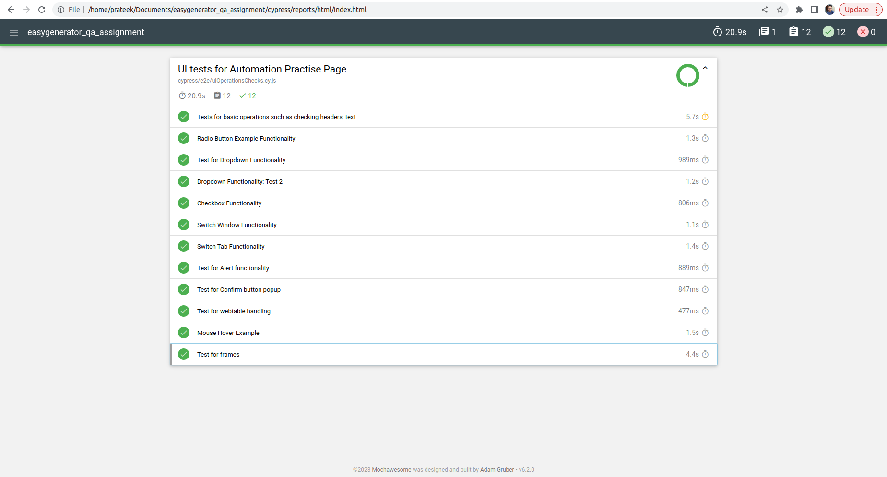

# easygenerator_qa_assignment

This readme explains the installation and usgae of the UI testing framework developed using [Cypress](https://docs.cypress.io/guides/getting-started/installing-cypress)

## Contents

- [Introduction](#markdown-header-introduction)
- [Installation](#markdown-header-installation)
- [Usage](#markdown-header-usage)
- [Debugging](#markdown-header-debugging)
- [Reporting](#markdown-header-reporting)
- [CI&CD](#markdown-header-cicd)
## Introduction

The framework is designed using Cypress and JavaScript as a scripting language. 
The application under test is [rahulshettyacademy.com](https://rahulshettyacademy.com/AutomationPractice/)
The tests are focussed from an E2E point(only UI) of view. All the functionalities such as wbetables, clicks, typing, frames and etc are covered.

Cypress environment is used to read necessary/recurring assertion data


## Installation 

All the code is committed to main branch : 

```
https://github.com/prateek1594/easygenerator_qa_assignment
```

### Process

```
1. `git clone https://github.com/prateek1594/easygenerator_qa_assignment`
2. cd to the `easygenerator_qa_assignment$` folder and run `npm install`

```

The above will build and install all the dependencies used in this project. 

** Please check for node modules on your machine. This project will however make  sure that all the dependencies are installed without any failure. Since , Cypress uses node.js server to execute tests, node modules are required.
** If you have any conflicts related to node.js version, please upgrade the version or use virtual environment.

## Usage

Once your project is set up and all the dependencies are installed without failure. You can run your tests now. 
But before jumping directly on how to run the tests, let us understand about the structure of the project.

- Folder Structure 
```
EASYGENERATOR_QA_ASSIGNMENT
    - .github/workflows : contains main.yml to run tests on GitHub Actions.
    - cypress
        -downloads : will contains reports after each run
        -e2e : all the tests are placed here
        -fixtures : static data are stored here
        -screenshots : when you run test uisng CLI(or locally), all screenshots are stored in this folder
        -support 
            - commands.js : all custom commands are wriiten here
            - e2e.js: all the custom commands are imported in this file as it is automatically loaded
            - pageObjects: contains page object for each pages on the UI
        -videos : when you run test uisng CLI, all videos are stored in this folder
    - .eslintrc.json : add rules on how to write code
    - node_modules : all the node modules, cypress are installed in this folder
    - .gitignore : all the things you dont want your git to see
    - .prettierrc : code fromatting rules are written
    - cypress.config.js : configuration of the project
    - package-lock.json : package dependencies
    - package.json : package definition
    - Readme.md : how to use this framework
```

### Run using command line

If you want to run your tests using command line, please use the following command

```
    Open your terminal
    cd to the project folder
    Run : npm run cy:runHeadless ( to run tests in headless mode)
    or, npm run cy:runHeaded ( to run tests in headed mode)
```

The above will collect all the tests and runs them on chrome browser. After the tests are completed, a report will be published on your terminal giving user an overview about the tests runs and statuses. Following sripts is used in package.json

```
"cy:runHeadless" : "npx cypress run test --browser chrome",
"cy:runHeaded" : "npx cypress run test --browser chrome --headed"
```

### Run using cypress GUI

If you want to run your tests using the Cypress Runner, please use the following commands

1. Open terminal
2. cd to the root of the project
3. Run [npm run cypress:open](package.json) , this will open the cypress runner. You can choose the spec to run and it will run all your tests inside that spec.

## Debuging

There might be scenarios where your tests will fail or be flaky. In this case you will need a debugger to debug your tests failure. 
[Cypress Runner](https://docs.cypress.io/guides/core-concepts/cypress-app#What-you-ll-learn) can be help you with that. Its an application designed by cypress to create, configure, browse and most importantly running your tests.

It is recommended to clear all sessions before running each tests(when debugging)

## Reporting

When running your tests locally(using CLI), a report will be automatically published on the terminal 

 ,

Also, under [downloads](cypress/downloads/reports/) you can find the report in html and json format. Mocha awesome reporter is used for this case.

## CI using Github Actions

GitHub actions are used to run your tests when a PR is pushed to a branch. 
Under [Actions](https://github.com/prateek1594/easygenerator_qa_assignment/actions) , you can find the runs. 
main.yml is created to utilize the flow. 
